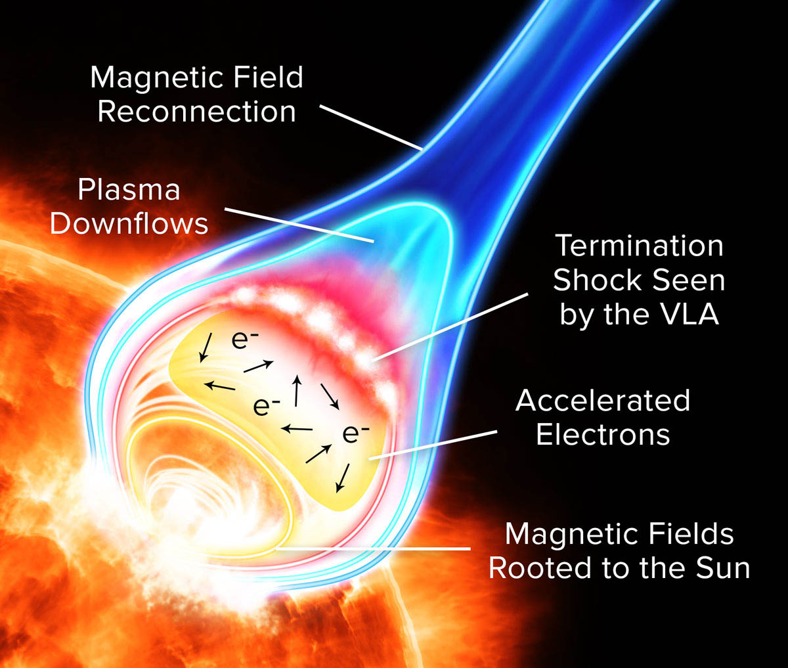
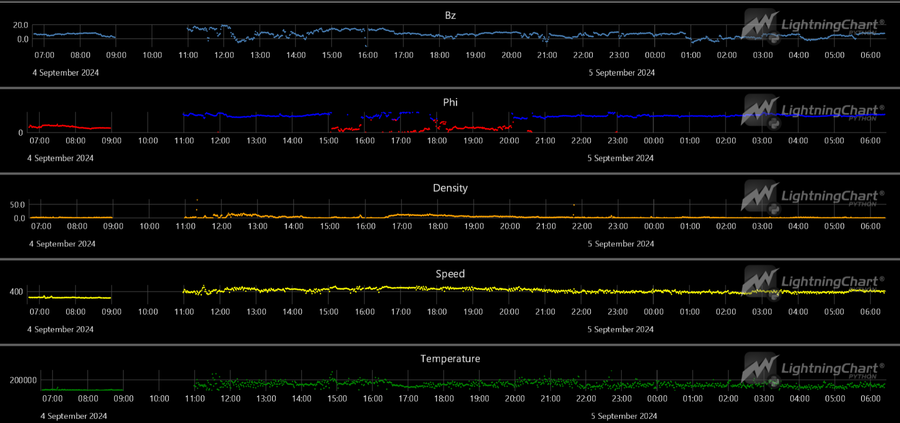

# Real-Time Visualization of Aurora Borealis probability using LightningChart Python## Introduction
Solar flares originate from regions of intense magnetic activity on the Sun, particularly around sunspots. They release huge amounts of energy in the form of radiation and energetic particles, including **protons, electrons, and heavier ions**. These high-energy particles, known as **solar energetic particles (SEPs)**, are ejected into space, traveling along the Sun’s magnetic field lines. If directed toward Earth, these charged particles can reach our planet in a matter of minutes to hours.

When solar flare emissions interact with Earth’s magnetic field, they can cause **geomagnetic storms**. These storms disturb satellite communications, GPS systems, and power grids. SEPs can also trigger the **Aurora Borealis (Northern Lights)**, a phenomenon caused when charged particles collide with Earth's magnetosphere, particularly at the polar regions. 

Thus, solar flares play a significant role in both technological disruptions and the creation of natural light shows like the aurora.

 

#### To model and visualize solar energetic particles (SEPs), particularly protons, these variables must be considered:
1. **Density of Protons**. A higher proton density increases the chance of geomagnetic storms when these particles collide with Earth’s magnetic field.
2. **Speed of Protons**. Faster protons carry more kinetic energy and can penetrate Earth’s magnetic shield more deeply, causing stronger geomagnetic disturbances.
3. **Direction of Travel**. Protons and other charged particles follow the Sun’s magnetic field lines, so their direction of travel is also important to consider.

## Correlation between particles bursts and the KP index 
The **Kp index** is a global geomagnetic activity index that measures disturbances in Earth’s magnetic field on a scale from 0 to 9. A higher Kp value indicates more intense geomagnetic storms, typically caused by solar wind and solar energetic particle (SEP) streams interacting with Earth's magnetosphere. It is widely used to assess the potential for space weather effects, such as disruptions to communication systems and the visibility of auroras.

The **density and speed of proton streams** from solar flares or coronal mass ejections (CMEs) directly affect Earth's geomagnetic activity. When high-density, high-speed streams reach Earth, they can compress the magnetosphere and intensify geomagnetic storms. A key factor in this interaction is the **Bz dimension** of Earth's magnetic field, which refers to the north-south orientation of the magnetic field in the solar wind. When the Bz component is **negative (southward)**, it aligns oppositely to Earth's magnetic field, allowing for stronger magnetic reconnection. This opens up the magnetosphere to more solar wind particles, intensifying geomagnetic disturbances
## LightningChart Python
For this task we may use [LightningChart](https://lightningchart.com/python-charts/) library. It provides a wide range of tools for creating graphs that can be useful for Northern Lights and geomagnetic analysis (which is almost the same) in Python. \
In this project, we will use XY Charts ([Link to docs](https://lightningchart.com/python-charts/docs/charts/chart-xy/)).

LightningChart uses GPUs for faster rendering, so it is possible to 'feed' it a huge sample of data.
## Setting Up Python Environment
For creating a Northern Lights prediction dashboard in Python, first we need to set up our Python environment. 
### Installation of Python on Mac
I recommend using [Homebrew package manager](https://brew.sh/) as it is popular and has a lot of packages.\
Moreover, it is arguably more convenient than installing Python using .dmg.

#### 1. First step is installing Homebrew itself
> You can skip this step if it is already installed on your Mac

Enter Terminal app and copy/paste this string
```sh
/bin/bash -c "$(curl -fsSL https://raw.githubusercontent.com/Homebrew/install/HEAD/install.sh)"
```
:exclamation: **Important note:** 
  Installation of Homebrew can be not fast, usually from 5 to 15 minutes.

#### 2. Installation of Python
```sh
brew install python
```
This command will install the latest stable version of python.


<details>
  <summary><b>If you don't want to use Homebrew</b></summary>
  You can access the <a href = 'https://www.python.org/downloads/macos/'>official Python website</a>, select the      latest stable version downloader for MacOS (it is named macOS 64-bit universal2 installer) and follow the installation instructions.
</details>

You can check the version using `python3 –version` in Terminal.
> If it displays `Unknown command` error, it is most likely due to PATH variables. Refer to  
[this guide](https://www.mygreatlearning.com/blog/add-python-to-path/) to fix.

---
### Installation of Python on Windows
I recommend using cli tool [Winget](https://learn.microsoft.com/en-us/windows/package-manager/winget/). 

#### Install Python package
Open cmd or PowerShell as Administrator and type in:
```powershell
winget install Python.Python.3
```

<details>
  <summary><b>If you don't want to use Winget</b></summary>
  You can access the <a href = 'https://www.python.org/downloads/macos/'>official Python website</a>, select the      latest stable version downloader for Windows <br> (it is named Windows installer (64-bit)) and follow the installation instructions.
</details>

You can verify installation of python and pip by typing `python --version` and `pip --version` respectively. 
> If it displays `'command' is not recognized` error, it is most likely due to PATH variables. Refer to [this guide](https://www.mygreatlearning.com/blog/add-python-to-path/) to fix.

---

### Installation of IDE
For IDE (integrated development environment) I recommend using [PyCharm](https://www.jetbrains.com/pycharm/download/?section=mac) as it is clean and powerful. However, full version is paid so you can also use [VSCode](https://code.visualstudio.com/).

(*Optional*) You may want to set up `venv` (Python virtual environment) so you can install packages there and not clutter the Python installation.
Environment creating instructions:
- PyCharm - https://www.jetbrains.com/help/pycharm/creating-virtual-environment.html#python_create_virtual_env
- VSCode - https://code.visualstudio.com/docs/python/environments

Then, using the terminal (IDEs have integrated terminals) install needed packages:
```sh
pip install pandas lightningchart
```
---
### Libraries Used
#### Pandas
In this project, we will mainly use the dataframe, two-dimensional data structure provided by Pandas. It can be easily created from CSV or Excel file.

#### NumPy
NumPy is provided with Pandas and it is a fundamental package for scientific computing in Python. It provides support for arrays, mathematical functions, and linear algebra operations.

#### LightningChart
Lightningchart is the main library used in the project for creating white blood cell flow chart in Python. It provides a highly customizable graph building tools, including simple XY charts, 3D charts, Bar charts, Spider charts, Map charts. However, this time we will use only XY chart (and Point Series).

## Import Needed Libraries
Firstly, we need to import needed libraries.
We use `datetime` for working with timestamps, `math` to make equations.
Also, we use external libraries `pandas`, `numpy` and `lightningchart`.


```python
from datetime import datetime
import math

import pandas as pd
import lightningchart as lc
import numpy as np
```

## LightningChart License
To activate license for your project, we use the following
```python
with open("license_key.txt", "r") as file:  # License key is stored in 'license_key.txt'
    key = file.read()
lc.set_license(key)
```
> Important! I always recommend storing license keys and other sensitive information in separate files that are included in `.gitignore` file.

## Loading and Processing Data
You can find suitable data at Space Weather Prediction website (https://services.swpc.noaa.gov/products/solar-wind/).

You can use either pair of files, be it 1 day or 2 hours etc. There is a ready-made script to download and merge the files (`file_download.py`). If you want to use other files from this index, you can change these urls inside the script:
```python
# urls of the data
url1 = "https://services.swpc.noaa.gov/products/solar-wind/mag-1-day.json"
url2 = "https://services.swpc.noaa.gov/products/solar-wind/plasma-1-day.json"
```
You can retrieve the real-time data by running the script (`file_download.py`). The updated file will be in `data` folder.

To extract data from .csv file and store it in dataframe we need to use `pd.read_csv` function. After this, we need to convert dataframe columns to lists.

```python
df = pd.read_csv('data/output.csv')  # read csv
```

Then it is needed to evaluate phi, which is needed for analysis.
```python
# normalize phi - first calculated using np.arctan2() and then mapped to range(0, 2pi) using np.mod
df['phi_gsm'] = np.degrees(np.mod(np.arctan2(df["by_gsm"], df["bx_gsm"]), 2 * np.pi))

df.fillna(0, inplace=True)  # fill na values as 0s to avoid errors
print(df.head(), df.tail())  # print head tail of dataframe (optional)
```

After it, we create lists to import them to Chart Series.
```python
# create lists
y_bz = df['bz_gsm'].to_list()
y_density = df['density'].to_list()
y_phi = df['phi_gsm'].to_list()
y_speed = df['speed'].to_list()
y_temp = df['temperature'].to_list()
x = df['time_tag'].to_list()
```

One of the important steps is to convert the datetime to appropriate format so LightningChart can read it properly. In our case it is timestamp in milliseconds.
```python
def convert_to_timestamp(dt_str):
    dt_format = "%Y-%m-%d %H:%M:%S.%f"

    # parse the datetime string into a datetime object
    dt = datetime.strptime(dt_str, dt_format)

    # convert datetime object to Unix timestamp
    timestamp = dt.timestamp() * 1000

    return timestamp


x_time = [convert_to_timestamp(dt) for dt in x]
```

## Visualizing Data with LightningChart
Let's initialize Dashboard, and then ChartXYs from LightningChart library. 
Also, we can customize titles, as well as point color and sizes

```python
dashboard = lc.Dashboard(columns=1, rows=5, theme=lc.Themes.Black)  # initialize Dashboard

chart_bz = dashboard.ChartXY(column_index=0, row_index=0, title='Bz')  # create first chart
chart_bz.get_default_x_axis().dispose()
chart_bz.add_x_axis(axis_type="linear-highPrecision").set_tick_strategy("DateTime")  # change axis to datetime format
series_bz = chart_bz.add_point_series().append_samples(  # insert data
    x_values=x_time,
    y_values=y_bz
).set_point_size(3)  # size of points (for visual purposes)
```

Then, we can repeat the same for other 4 XY charts.

## Result


In this case, the data is interrupted between 9:00 and 11:00. We can do nothing about that, because the data source was interrupted. You can check the charts at https://www.swpc.noaa.gov/products/real-time-solar-wind.

## Conclusion
The parameters visualized in graphs are useful for geomagnetic storms prediction:

- **Bz**: **negative Bz** is a strong indicator of severe geomagnetic storms

- **Phi**: Phi can help track the **source of the solar wind** contributing to the storm.

- **Density**: high solar wind density typically amplifies geomagnetic storms, as it increases the dynamic pressure on the magnetosphere.

- **Speed**: geomagnetic storms caused by high-speed solar wind are typically **longer-lasting but less intense** than those triggered by slower winds

- **Temperature**: tracking temperature changes helps to analyze the **energy profile of the storm** and the behavior of incoming solar wind structures.

#### Benefits of using LightningChart
LightningChart provides a lot of ready-made options for creating graphs. It is easy to create interactive charts for Northern Lights prediction in python using this library.  
There are lots of other tools in the library, you can review various code snippets for different tasks at [LightningChart Python Guide](https://lightningchart.com/python-charts/docs/).

## Sources used
1. NASA - Solar Dynamics Observatory (SDO): https://sdo.gsfc.nasa.gov/
2. Space Weather Prediction Center: https://www.swpc.noaa.gov/
3. LightningChart - [lightningchart.com](https://lightningchart.com/python-charts/docs/guides/axes/)
4. pandas - [pandas.pydata.org](https://pandas.pydata.org/)
5. numpy - https://numpy.org/