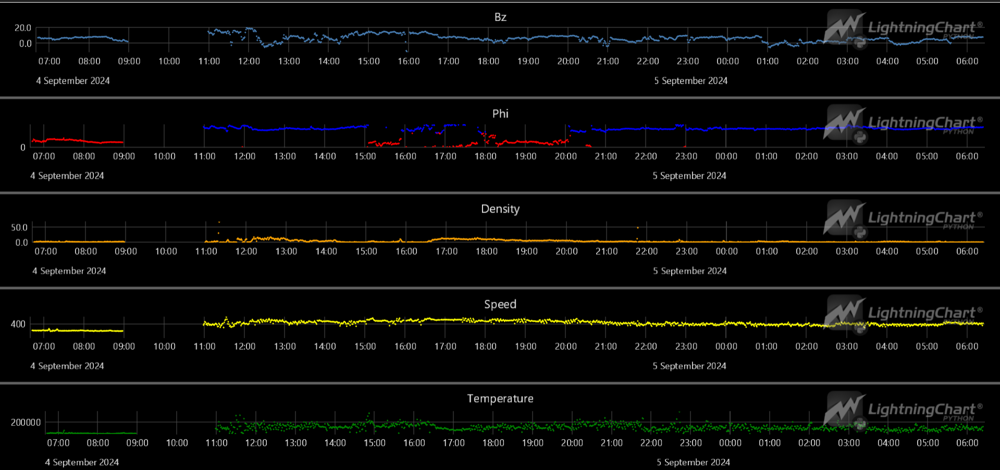
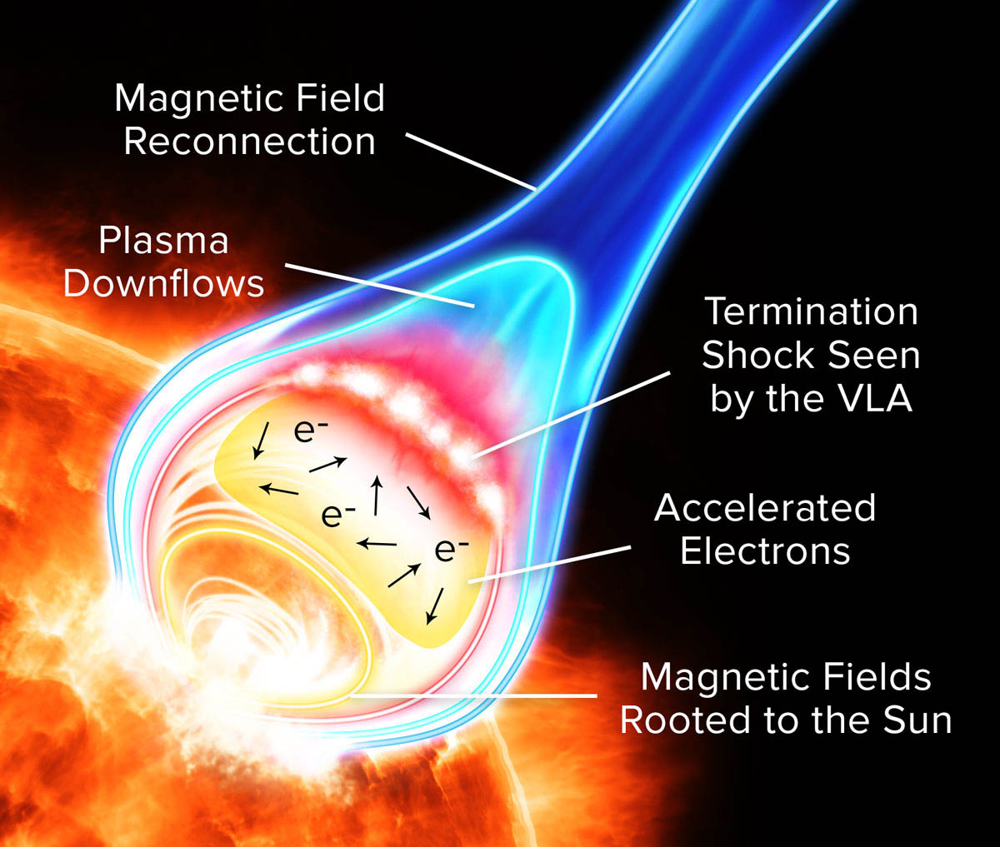

# Solar Wind & Aurora Data Visualization

This project retrieves and processes solar-wind and space-weather data from external sources and visualizes time-series conditions related to geomagnetic activity using Python, pandas, NumPy, and LightningChart. It shows a complete data flow from NOAA Space Weather Prediction Center JSON data to pandas preprocessing, numerical transformation, derived features, and an interactive LightningChart dashboard.

<p align="center">
  
</p>

## Overview

This project:

- retrieves solar-wind and space-weather data from external data sources;
- parses and combines time-series datasets;
- handles timestamps and missing values;
- performs numerical transformations and derived calculations;
- visualizes multiple signals in an interactive dashboard.

## Highlights

- Retrieved real-world solar-wind data from external JSON/API sources
- Processed and merged time-series datasets with pandas
- Handled timestamps, missing values, and numerical transformations
- Calculated derived space-weather features with NumPy
- Built a multi-chart interactive dashboard with LightningChart
- Visualized changing solar-wind conditions over time

## Tech Stack

`Python · pandas · NumPy · REST/JSON APIs · LightningChart`

## Detailed Walkthrough

### Introduction

Solar flares originate from regions of intense magnetic activity on the Sun, particularly around sunspots. They release energy in the form of radiation and energetic particles, including protons, electrons, and heavier ions. These high-energy particles are often discussed as solar energetic particles, or SEPs.

When solar activity interacts with Earth's magnetic field, it can contribute to geomagnetic disturbances. These conditions are relevant to space-weather monitoring, satellite communication, GPS systems, power-grid operations, and aurora visibility.

This project focuses on retrieving, processing, and visualizing real-world solar-wind measurements that are commonly used when monitoring geomagnetic conditions.



### Solar-Wind Signals and the Kp Index

The Kp index is a global geomagnetic activity index that measures disturbances in Earth's magnetic field on a scale from 0 to 9. Higher Kp values are associated with stronger geomagnetic activity and are often used as one indicator for space-weather conditions and aurora visibility.

Solar-wind density, speed, temperature, and magnetic-field components can help describe changing near-Earth solar-wind conditions. This project visualizes several of those measurements over time, including Bz, density, speed, temperature, and a derived phi angle.

### Data Flow

The project follows this pipeline:

```text
NOAA SWPC solar-wind JSON data
-> raw magnetic-field and plasma time-series rows
-> merged CSV file
-> pandas preprocessing
-> NumPy-derived phi angle and timestamp conversion
-> LightningChart dashboard
```

### LightningChart Python

This project uses the [LightningChart](https://lightningchart.com/python-charts/) Python library to build an interactive dashboard of time-series charts. The implementation uses a LightningChart dashboard with five XY charts and point series for:

- Bz
- Phi
- Density
- Speed
- Temperature

LightningChart's time-axis support is used after converting source timestamps into millisecond Unix timestamps.

### Libraries Used

#### pandas

pandas is used to load the merged CSV file, work with tabular time-series data, fill missing values, and extract columns for plotting.

#### NumPy

NumPy is used to calculate the derived `phi_gsm` angle from magnetic-field components using `np.arctan2`, `np.mod`, and `np.degrees`.

#### requests

`requests` is used in `file_download.py` to retrieve JSON data from NOAA SWPC endpoints.

#### LightningChart

LightningChart is used to create the multi-chart dashboard and render time-series point plots for each processed signal.

### Import Needed Libraries

```python
from datetime import datetime
import math

import pandas as pd
import lightningchart as lc
import numpy as np
```

### LightningChart License

The visualization script reads a local LightningChart license key before rendering charts:

```python
with open("license_key.txt", "r") as file:  # License key is stored in 'license_key.txt'
    key = file.read()
lc.set_license(key)
```

Keep license keys and other sensitive values in local files that are excluded from version control.

### Loading and Processing Data

The data is retrieved from the NOAA Space Weather Prediction Center solar-wind product index:

https://services.swpc.noaa.gov/products/solar-wind/

The repository includes `file_download.py`, which downloads and merges one-day magnetic-field and plasma JSON datasets:

```python
import requests


# urls of the data
url1 = "https://services.swpc.noaa.gov/products/solar-wind/mag-1-day.json"
url2 = "https://services.swpc.noaa.gov/products/solar-wind/plasma-1-day.json"

# getting the data
data1 = requests.get(url1).json()
data2 = requests.get(url2).json()

# merge the two files together
merged_list = [sublist1 + sublist2 for sublist1, sublist2 in zip(data1, data2)]
file_path = 'data/output.csv'

# write the merged list to the file
with open(file_path, 'w') as file:
    for sublist in merged_list:
        l = [str(item) if item is not None else '' for item in sublist]
        string_to_write = ','.join(l)
        file.write(string_to_write + "\n")
```

Running `file_download.py` updates `data/output.csv`.

The visualization script then loads the merged CSV file with pandas:

```python
df = pd.read_csv('data/output.csv')  # read csv
```

It calculates the derived `phi_gsm` angle from the `by_gsm` and `bx_gsm` columns, then fills missing values:

```python
# normalize phi - first calculated using np.arctan2() and then mapped to range(0, 2pi) using np.mod
df['phi_gsm'] = np.degrees(np.mod(np.arctan2(df["by_gsm"], df["bx_gsm"]), 2 * np.pi))

df.fillna(0, inplace=True)  # fill na values as 0s to avoid errors
print(df.head(), df.tail())  # print head tail of dataframe (optional)
```

The processed columns are converted to lists for LightningChart series:

```python
# create lists
y_bz = df['bz_gsm'].to_list()
y_density = df['density'].to_list()
y_phi = df['phi_gsm'].to_list()
y_speed = df['speed'].to_list()
y_temp = df['temperature'].to_list()
x = df['time_tag'].to_list()
```

The source timestamps are converted to millisecond Unix timestamps for the chart axis:

```python
def convert_to_timestamp(dt_str):
    dt_format = "%Y-%m-%d %H:%M:%S.%f"

    # parse the datetime string into a datetime object
    dt = datetime.strptime(dt_str, dt_format)

    # convert datetime object to Unix timestamp
    timestamp = dt.timestamp() * 1000

    return timestamp


x_time = [convert_to_timestamp(dt) for dt in x]
```

### Visualizing Data with LightningChart

The dashboard contains five stacked XY charts. Each chart uses the converted timestamp values on the x-axis and one processed solar-wind signal on the y-axis.

```python
dashboard = lc.Dashboard(columns=1, rows=5, theme=lc.Themes.Black)  # initialize Dashboard

chart_bz = dashboard.ChartXY(column_index=0, row_index=0, title='Bz')  # create first chart
chart_bz.get_default_x_axis().dispose()
chart_bz.add_x_axis(axis_type="linear-highPrecision").set_tick_strategy("DateTime")  # change axis to datetime format
series_bz = chart_bz.add_point_series().append_samples(  # insert data
    x_values=x_time,
    y_values=y_bz
).set_point_size(3)  # size of points (for visual purposes)
```

The same structure is repeated for `Phi`, `Density`, `Speed`, and `Temperature`.

For the `Phi` chart, the project also uses a color lookup table:

```python
series_phi = chart_phi.add_point_series().append_samples(
    x_values=x_time,
    y_values=y_phi
).set_point_size(3).set_point_color_lookup_table(  # color points
    steps=[
        {'value': math.nextafter(225, 226), 'color': lc.Color('blue')},  # blue color if phi > 225
        {'value': 225, 'color': lc.Color('red')}  # red color if phi <= 225
    ],
    look_up_property='y',  # based on y value
    interpolate=True,
    percentage_values=False
)
```

### Result


The chart shown here uses the available data in `data/output.csv`. In this saved example, there is a visible gap in the data between about 9:00 and 11:00, matching an interruption in the source data. The source can be checked at the NOAA SWPC real-time solar-wind product page:

https://www.swpc.noaa.gov/products/real-time-solar-wind

### Conclusion

This project demonstrates a Python pipeline for retrieving NOAA SWPC solar-wind JSON data, combining magnetic-field and plasma measurements, preprocessing the resulting time series with pandas, calculating a derived phi angle with NumPy, and visualizing multiple signals with LightningChart.

The dashboard is intended for exploratory space-weather visualization. It shows changing solar-wind conditions over time rather than making a standalone forecast.

## Running the Project

Install the Python packages used by the scripts:

```sh
pip install pandas numpy lightningchart requests
```

Add your LightningChart license key to a local `license_key.txt` file before running the visualization script.

To retrieve the latest one-day NOAA SWPC solar-wind data and update the local CSV:

```sh
python file_download.py
```

To open the dashboard:

```sh
python aurora_visualization_pred.py
```

## Sources Used

1. NASA - Solar Dynamics Observatory (SDO): https://sdo.gsfc.nasa.gov/
2. NOAA Space Weather Prediction Center: https://www.swpc.noaa.gov/
3. NOAA SWPC solar-wind products: https://services.swpc.noaa.gov/products/solar-wind/
4. NOAA SWPC real-time solar wind: https://www.swpc.noaa.gov/products/real-time-solar-wind
5. LightningChart - [lightningchart.com](https://lightningchart.com/python-charts/docs/guides/axes/)
6. pandas - [pandas.pydata.org](https://pandas.pydata.org/)
7. NumPy - https://numpy.org/
